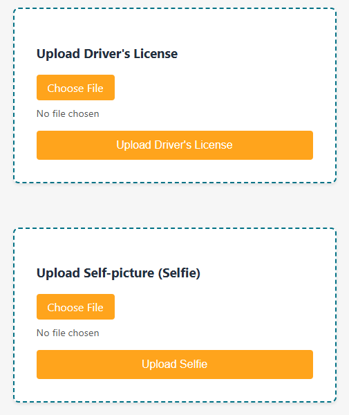

# AnyCompany ID Verification System

This React application allows users to upload driver's license and selfie images to an AWS S3 bucket for ID verification purposes.

<p align="center">
  
</p>

## Prerequisites

Before you begin, ensure you have the following installed:
- Node.js (v14.0.0 or later)
- npm (v6.0.0 or later)

You will also need:
- A deployment of [the Amazon Rekognition Identity Verification sample repository](https://github.com/troydieter/amazon-rekognition-identity-verification) first. You'll use the output from this to feed the `.env` file for credentials.
- An AWS account with S3 access
- AWS access key ID and secret access key (retrieved from the Amazon Rekognition Identity Verification sample deployment)

## Setup

1. Clone the repository:
   ```
   git clone https://github.com/your-username/anycompany-id-verification.git
   cd anycompany-id-verification
   ```

2. Install dependencies:
   ```
   npm install
   ```

3. Set up environment variables:
   - Copy the `.env.example` file to a new file named `.env`:
     ```
     cp .env.example .env
     ```
   - Open the `.env` file and replace the placeholder values with your actual AWS credentials and S3 bucket information:
     ```
     REACT_APP_AWS_ACCESS_KEY_ID=your_access_key_id
     REACT_APP_AWS_SECRET_ACCESS_KEY=your_secret_access_key
     REACT_APP_REGION=your_aws_region
     REACT_APP_S3_BUCKET=your_s3_bucket_name
     ```

## Running the Application

To start the development server:

```
npm start
```

This will run the app in development mode. Open [http://localhost:3000](http://localhost:3000) to view it in your browser.

## Building for Production

To create a production build:

```
npm run build
```

This command builds the app for production to the `build` folder. It correctly bundles React in production mode and optimizes the build for the best performance.

To serve the production build locally:

```
npm install -g serve
serve -s build
```

## Usage

1. Open the application in a web browser.
2. You will see two upload boxes: one for the driver's license and one for the selfie.
3. Click "Choose File" to select an image for each category.
4. Click the "Upload" button for each image to send it to the S3 bucket.
5. The files will be uploaded to a unique folder in your S3 bucket, named with the current date, time, and a UUID.

## Folder Structure in Amazon S3

The uploaded files will be stored in S3 with the following structure:

```
YYYY-MM-DD_HH-MM-SS_UUID/
├── dl/
│   └── drivers_license_filename.jpg
└── selfie/
    └── selfie_filename.jpg
```

## Troubleshooting

- If you encounter CORS issues, ensure your S3 bucket has the appropriate CORS configuration.
- Check that your AWS credentials in the `.env` file are correct and have the necessary permissions.
- If the application isn't picking up your environment variables, try restarting the development server.

## Security Note

This application handles sensitive information. Ensure that you follow best practices for securing your AWS credentials and protecting user data. Never commit your `.env` file to version control.

## Contributing

If you'd like to contribute, please fork the repository and use a feature branch. Pull requests are warmly welcome.

## Licensing

The code in this project is licensed under MIT license.